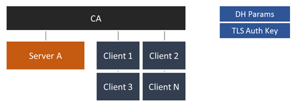

X509v3 Certificate Management Utility
======================================

**single-file-utlity to manage X509v3 certificate based public-key-infrastructures (PKI)**

## Features ##

* Single File CLI Tool
* [Create CA](docs/Usage.md#init-ca)
* [Create CA, TLS Auth, Server Cert, DH-Params](docs/Usage.md#init-openvpn) **in one step for OpenVPN**
* [Add Clients](docs/Usage.md#client-add)
* [Revoke Clients](docs/Usage.md#client-revoke)
* [Add Server](docs/Usage.md#server-add)
* [Revoke Clients](docs/Usage.md#server-revoke)
* [View Certificates](docs/Usage.md#view-certificate)
* [Verify Certificates](docs/Usage.md#verify-certificate)
* Maintain Certificate revocation list

## Usage ##

```raw
Usage: x509-tool <command> [args...]

  Commands:
    init ca <ca-name>           Initializes basic ca directory structure
    init openvpn <ca-name>      Initializes CA + tls auth, dhparams and single server
    
    verify <cert-file>          Verifies a certificate against CRL
    show <cert-file>            Display a certificate as text

    client add <cname>          Add a new client certificate
    client revoke <cname>       Revoke a client certificate
    
    server add <cname>          Add a new server certificate
    server revoke <cname>       Revoke a server vertificate
    
    host add <cname>            Add a new host certificate
    host revoke <cname>         Revoke a host vertificate

    code add <cname>            Add a new codesigning certificate
    code revoke <cname>         Revoke a codesigning certificate
    
    --help                      Displays this help
    --version                   Displays version
```


## Documentation and Tutorials ##

* [Usage/Available Commands](docs/Usage.md)
* [OpenVPN Client/Server Configuration](docs/OpenVPN.md)
* [DD-WRT Server Configuration](docs/OpenVPN_DDWRT.md)

## Installation ##

### 1. Add Aenon-Dynamics Repository ###

See [AenonDynamics/CPR](https://github.com/AenonDynamics/CPR#debian-packages)

### 2. Install the Package via APT ###

```bash
apt-get install x509-tool
```

## Preface ##

**The X509-Tool is designed as [easy-rsa](https://github.com/OpenVPN/easy-rsa) replacement**

The primary objective is the creation of a simple, bulletproof tool which allows users to setup Certificates for TLS Authentication (Webservers, Databases, OpenVPN).

### Basic CA Structure ###

In most cases (e.g. OpenVPN or Webserver Auth) your typical PKI will look like this:



* 1 Certificate Authority
* 1 to N Servers
* 1 to N Clients
* No Intermediate CA
* Cerificate Depths of **1**

### Directory Structure ###

The **X506-Tool** will create the following directory structure in your working dir

```raw
<working-dir>
   |- ca (the Cerificate Authority files, database, ..)
   |     |- ca.crt
   |     |- ca.key
   |     |- db.txt (list of all issued/revoked certs)
   |     |- serial (certificate serial number counter)
   |     |- crl.pem (Certificate revocation list)
   |
   |- servers (the Server Certificate, Private Key)
   |     |- <server-name-a>
   |     |- <server-name-b>
   |         |- server.crt
   |         |- server.key
   |         |- server.csr
   |         |- server.p12
   |
   |- clients (Storage of the Client Certificates)
         |- <client-name-a>
         |- <client-name-b>
             |- client.crt
             |- client.key
             |- client.p12 (Client Cert+Key + CA Cert as single file)
             |- client.csr
```

### OpenSSL Configuration ###

The Tool is shipped with a customized `openssl.conf` file which matches the used directory structure as well as client/server handling.
**Do not edit** this file if your are not sure what you're doing!

## Initial Setup ##

### Configuration File ###

First of all, you have to create a configuration file name `cert.conf` in your desired **working directory** (/opt/pki-mgmt/server1 in the example above). 
This file contains some basic settings like the keysize, lifetime and certificate informations.

The `X_COMMON_NAME` variables allows you to customize the common names of the CA or any generated Cert. This is especially useful for HTTPS Authentication were the common-name has to match the URL!
By default, the tool prefixes the common-names with their task. The placeholder `%s` is expanded by the second cli argument (name).

**All Options are required** 

```bash
#!/bin/bash

# OpenSSL Related Configuration
# -----------------------------------------------

# Recommended Key Size: >= 3072 bit
export KEY_SIZE=4096

# In how many days should the root CA key expire?
export CA_EXPIRE=3650

# In how many days should certificates expire?
export CRT_EXPIRE=3650

# Your Cert Params
export KEY_COUNTRY="DE"
export KEY_PROVINCE="BERLIN"
export KEY_CITY="BERLIN"
export KEY_ORG="My Company"
export KEY_EMAIL="pki-test@yourdomain.tld"
export KEY_OU="OVPN-PKI Testing"

# Certificate Common Name Templates
# -----------------------------------------------

# The placeholder %s is replaced by the second CLI argument
CA_COMMON_NAME="CA_%s"
ICA_COMMON_NAME="ICA_%s"
SRV_COMMON_NAME="SRV_%s"
CLIENT_COMMON_NAME="CLIENT_%s"
HOST_COMMON_NAME="HOST_%s"
CODESIGNING_COMMON_NAME="CODE_%s"
```

### Getting Started ###

Please refer to the [Usage/Available Commands](docs/Usage.md) Section for general usage informations

```bash
# Step 1
# create the CA (Crt+Key)
# "MyCA" is the common name of your CA Cert (Variable CA_COMMON_NAME)
$ x509-tool init ca MyCA

# Step 2
# Create your first Server named "server1"
$ x509-tool server add server1.mydomain.tld

# Step 3
# Create your first Client named "user1"
$ x509-tool client add user1.users.mydomain.tld
```

## Security Recommendations ##

* Keep your **Private Keys secret** - especially the CA Key.
* Consider to **encrypt** your Private Keys by a strong passphrase using AES256

## Contributing ##
Contributors are welcome! Even if you are not familiar with X509 certificates or bash scripting you can help to improve the documentation!

## Resources ##

A set of useful resources

* [Public key infrastructure](https://en.wikipedia.org/wiki/Public_key_infrastructure) | Page
* [AES](https://en.wikipedia.org/wiki/<Advanced_Encryption_Standard></Advanced_Encryption_Standard>) | Page
* [Transport Layer Security](https://en.wikipedia.org/wiki/Transport_Layer_Security) | Page
* [OpenSSL Certificate Authority](https://jamielinux.com/docs/openssl-certificate-authority/index.html) | Page
* [OpenVPN HOWTO](https://openvpn.net/index.php/open-source/documentation/howto.html) | Page
* [easy-rsa](https://github.com/OpenVPN/easy-rsa) | Page
* [BSI Cryptographic Key Recommendations](https://www.bsi.bund.de/SharedDocs/Downloads/DE/BSI/Publikationen/TechnischeRichtlinien/TR02102/BSI-TR-02102.pdf?__blob=publicationFile) (German) | PDF
* [NIST Recommendation for Key Management](http://nvlpubs.nist.gov/nistpubs/SpecialPublications/NIST.SP.800-57Pt3r1.pdf) | PDF

## License ##
X509-Tool is OpenSource and licensed under the Terms of [Mozilla Public License 2.0](https://opensource.org/licenses/MPL-2.0). 
You're welcome to contribute!