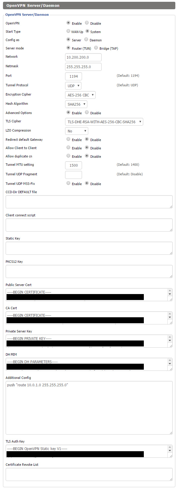

DD-WRT OpenVPN Setup
====================

It is quite easy to setup an OpenVPN Server with [DD-WRT](https://www.dd-wrt.com/site/).

## Step by Step Guide ##

1. Generate the Certificates with the X509-Tool
2. Go to **DD-WRT -> Services -> VPN**
3. Copy the Content of `ca/ca.crt` into the Section **CA Cert**
4. Copy the Content of `srv/server.crt` into the Section **Public Server Cert**
5. Copy the Content of `srv/server.key` into the Section **Private Server Cert**
6. Copy the Content of `srv/dh4096.pem` into the Section **DH PEM**
7. Copy the Content of `srv/tls-auth.key` into the Section **TLS Auth Key**
8. Select **AES-256-CBC** as Encryption Cipher
9. Select **SHA256** as Hash Algorithm
10. Select a strong Cipher like **TLS-DHE-RSA-WITH-AES-256-CBC-SHA256** for Key Exchange/Handshake

## Recommended Configuration ##

